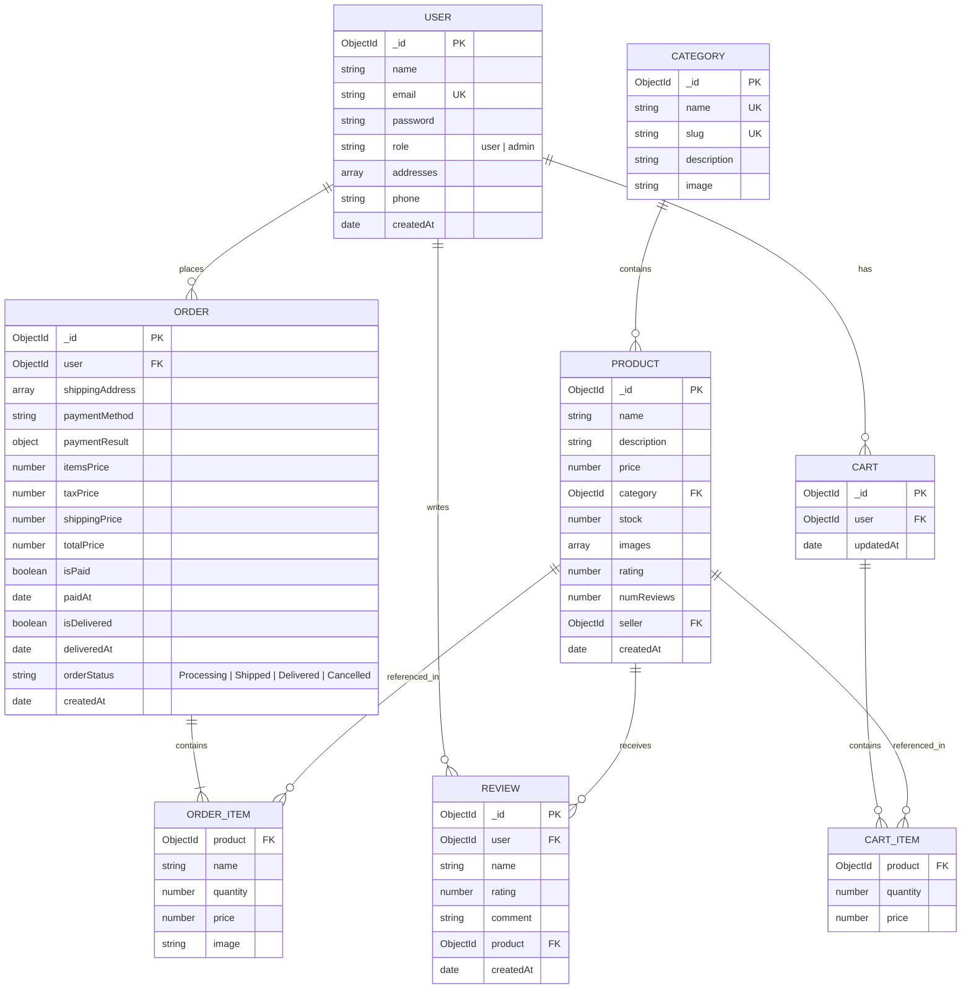

# Entity Relationship (ER) Diagram

This document details the database schema and relationship designs for the E-commerce system.

## Schema Definitions

1. **User Schema**: Stores information for authentication and delivery. The `email` field is indexed and unique.
2. **Product Schema**: References the `category` model and holds metadata like inventory stock, pricing, and ratings.
3. **Category Schema**: Groups items for easier browse capabilities.
4. **Order Schema**: Links users to their purchase history, mapping shipping addresses and payment confirmation codes.
5. **Cart Schema**: Ensures persistent customer shopping cart records.
6. **Review Schema**: Collects consumer feedback on individual products.

---
[◄ Back to Project Architecture](../project_architecture.md) | [Back to Home](../README.md)
