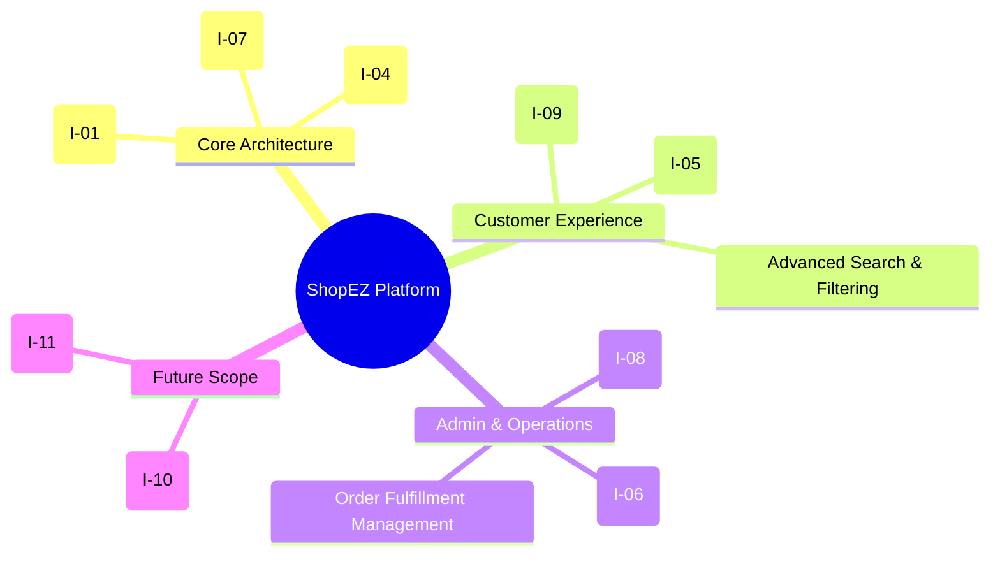

# Brainstorming & Idea Prioritization

**Document Version**: 1.1
**Date**: 11 June 2026
**Project Name**: ShopEZ — MERN Stack E-commerce Application
**Phase**: Brainstorming & Ideation

---

## 1. Introduction

This document records the structured brainstorming and ideation process undertaken at the inception of the **ShopEZ** project. The objective of this phase was to collaboratively identify user pain points, generate candidate solutions, and systematically prioritise features using established frameworks. The output of this document directly informs the Problem Statement Definition and Requirement Analysis phases.

---

## 2. Step 1 — Problem Statement Selection

Following an initial stakeholder analysis and competitive landscape review, the team converged on the following core problem statement:

> **Problem Statement**: Small and medium-sized businesses lack the technical resources to establish a customised, scalable online storefront, while end-consumers demand a seamless, fast, and secure shopping experience — encompassing intuitive search, dynamic filtering, persistent cart state, and trusted multi-gateway payment processing.

This statement was validated against two primary user segments:
- **B2C Shoppers**: Individuals seeking a reliable, friction-free purchasing experience.
- **B2B Store Administrators**: Business operators requiring efficient inventory, order, and analytics management.

---

## 3. Step 2 — Idea Generation & Grouping

### 3.1 Raw Idea Listing

The following candidate ideas were generated during the brainstorming session:

| Idea ID | Idea Description | Category | Retained? |
| :------ | :--------------- | :------- | :-------- |
| I-01 | Build a custom MERN stack application for full architectural control | Core Architecture | ✅ Yes |
| I-02 | Use Shopify as a SaaS platform | Existing Platforms | ❌ Discarded — insufficient customisability |
| I-03 | Use WooCommerce (WordPress) | Existing Platforms | ❌ Discarded — plugin overhead, no SPA support |
| I-04 | Implement JWT-based stateless authentication with HTTP-only cookies | Security | ✅ Yes |
| I-05 | Integrate a Payment Gateway (Stripe / Razorpay) for global/local payments | Payments | ✅ Yes |
| I-06 | Use Cloudinary CDN for optimised media/image storage | Media Management | ✅ Yes |
| I-07 | Implement Role-Based Access Control (Admin vs. Customer) | Access Control | ✅ Yes |
| I-08 | Build an interactive Admin Dashboard with real-time sales metrics | Admin Operations | ✅ Yes |
| I-09 | Persist shopping cart state using MongoDB for cross-device continuity | User Experience | ✅ Yes |
| I-10 | Implement AI-driven product recommendations | Advanced Features | 🔵 Future Scope |
| I-11 | Multi-vendor support | Marketplace Features | 🔵 Future Scope |

### 3.2 Idea Grouping (Affinity Diagram)

---

## 4. Step 3 — Idea Prioritisation (MoSCoW Framework)

The retained ideas were classified using the **MoSCoW** prioritisation method:

| Priority | Classification | Feature / Idea | Rationale |
| :------- | :------------- | :------------- | :-------- |
| 🔴 **Must Have** | Core — Release 1 | User Registration & JWT Authentication | Foundational to all user-specific operations |
| 🔴 **Must Have** | Core — Release 1 | Product Catalogue (CRUD Operations) | Primary business function; no storefront without it |
| 🔴 **Must Have** | Core — Release 1 | Shopping Cart (Add, Update, Remove) | Essential to purchase flow |
| 🔴 **Must Have** | Core — Release 1 | Multi-Step Checkout Flow | Core revenue-generating pathway |
| 🔴 **Must Have** | Core — Release 1 | Payment Gateway Integration | Order completion requires payment confirmation |
| 🟡 **Should Have** | Release 1 | Admin Dashboard (Sales Charts) | Enables business decision-making |
| 🟡 **Should Have** | Release 1 | Product Reviews & Ratings | Builds consumer trust and aids discovery |
| 🟡 **Should Have** | Release 1 | Cloudinary Image Management | Improves performance; required for scalable image serving |
| 🟢 **Could Have** | Release 2 | Wishlist Functionality | Improves retention, not blocking to launch |
| 🟢 **Could Have** | Release 2 | Advanced Product Recommendations (AI) | Non-trivial to implement; deferred to future roadmap |
| ⚪ **Won't Have** | Out of Scope | Multi-Vendor Marketplace | Requires significant architectural changes |

---

## 5. Conclusion

The brainstorming phase successfully distilled the project vision into a focused set of prioritised deliverables. The **Must Have** features constitute the minimum viable product (MVP) scope for Sprint 1 and Sprint 2. All accepted ideas map directly to User Stories defined in the *Requirement Analysis* phase.

---
*Document controlled by V S S S Manikanta — June 2026*
