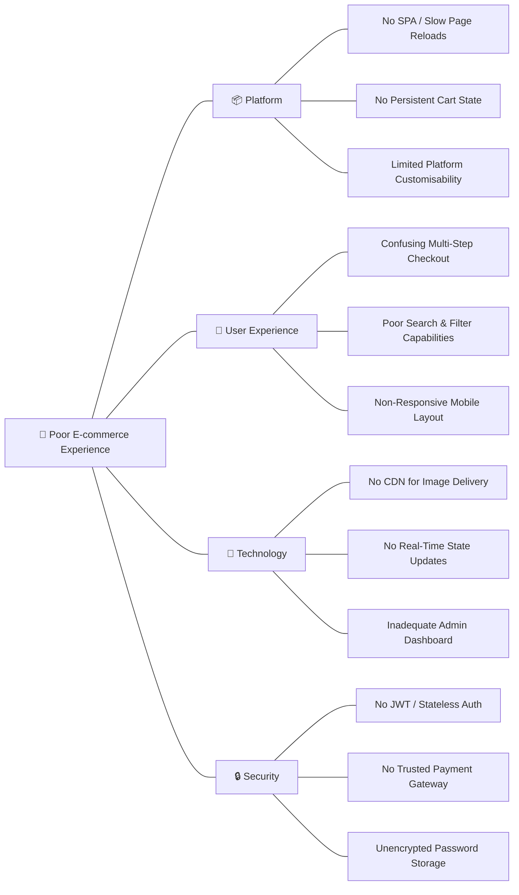

# Define Problem Statements

**Document Version**: 1.1
**Date**: 11 June 2026
**Project Name**: ShopEZ — MERN Stack E-commerce Application
**Phase**: Brainstorming & Ideation

---

## 1. Introduction

This document formalises the problem statements identified during the Brainstorming & Ideation phase. Each statement follows the structured **"I am / I'm trying to / But / Because / Which makes me feel"** framework to ensure user-centric problem articulation. Root-cause analysis is subsequently applied to identify systemic factors driving these problems.

---

## 2. Problem Statements

### PS-1: The Online Shopper

| Field | Description |
| :---- | :---------- |
| **I am** | A busy online shopper seeking electronics and clothing items |
| **I'm trying to** | Find and purchase specific items quickly and securely from a trusted platform |
| **But** | Existing stores suffer from poor search functionality, confusing multi-step checkouts, and loss of cart state across sessions |
| **Because** | Their systems are inadequately optimised — they lack advanced filtering, cross-device cart persistence, and seamless payment gateway integration |
| **Which makes me feel** | Frustrated, distrustful of the platform, and highly likely to abandon my cart prior to purchase |

**Impact Severity**: 🔴 High — Cart abandonment directly translates to revenue loss for the business.

---

### PS-2: The Store Administrator

| Field | Description |
| :---- | :---------- |
| **I am** | A business owner and store administrator responsible for daily operations |
| **I'm trying to** | Manage product inventory efficiently, track monthly sales, and ensure timely order fulfilment |
| **But** | The process is excessively time-consuming — updating product details, uploading images, and accessing sales insights requires navigating a clunky, non-intuitive dashboard |
| **Because** | Current systems lack a unified admin interface; image uploads are not CDN-optimised, and sales data is not aggregated in a readily interpretable format |
| **Which makes me feel** | Overwhelmed, inefficient, and deeply concerned about the scalability of business operations |

**Impact Severity**: 🔴 High — Operational inefficiency leads to delayed inventory updates, missed sales opportunities, and reduced business agility.

---

## 3. Root-Cause Analysis

The following Ishikawa (Fishbone) diagram identifies the systemic causes behind the identified problems:

---

## 4. Problem-to-Feature Mapping

Each identified root cause maps directly to a planned system feature:

| Root Cause | Proposed Solution Feature |
| :--------- | :------------------------ |
| No SPA / Slow page reloads | React.js Single Page Application with Virtual DOM |
| No persistent cart state | MongoDB-backed cart schema linked to authenticated user session |
| Poor search & filter | Full-text search with price, category, and rating filters |
| Confusing checkout | Guided 3-step checkout wizard (Address → Method → Payment) |
| No CDN for images | Cloudinary integration for optimised image delivery |
| No trusted payment gateway | Stripe / Razorpay payment gateway integration |
| Unencrypted passwords | Bcrypt password hashing before persistence |
| No JWT auth | JWT tokens stored in HTTP-only cookies for XSS prevention |
| No admin dashboard | Dedicated `/admin` panel with sales analytics and order management |

---

## 5. Conclusion

The two problem statements — representing the **end consumer** and the **store operator** — collectively define the dual-focus of the ShopEZ platform. All identified root causes have corresponding solution features mapped in the *Proposed Solution* and *Requirement Analysis* documents.

---
*Document controlled by V S S S Manikanta — June 2026*
