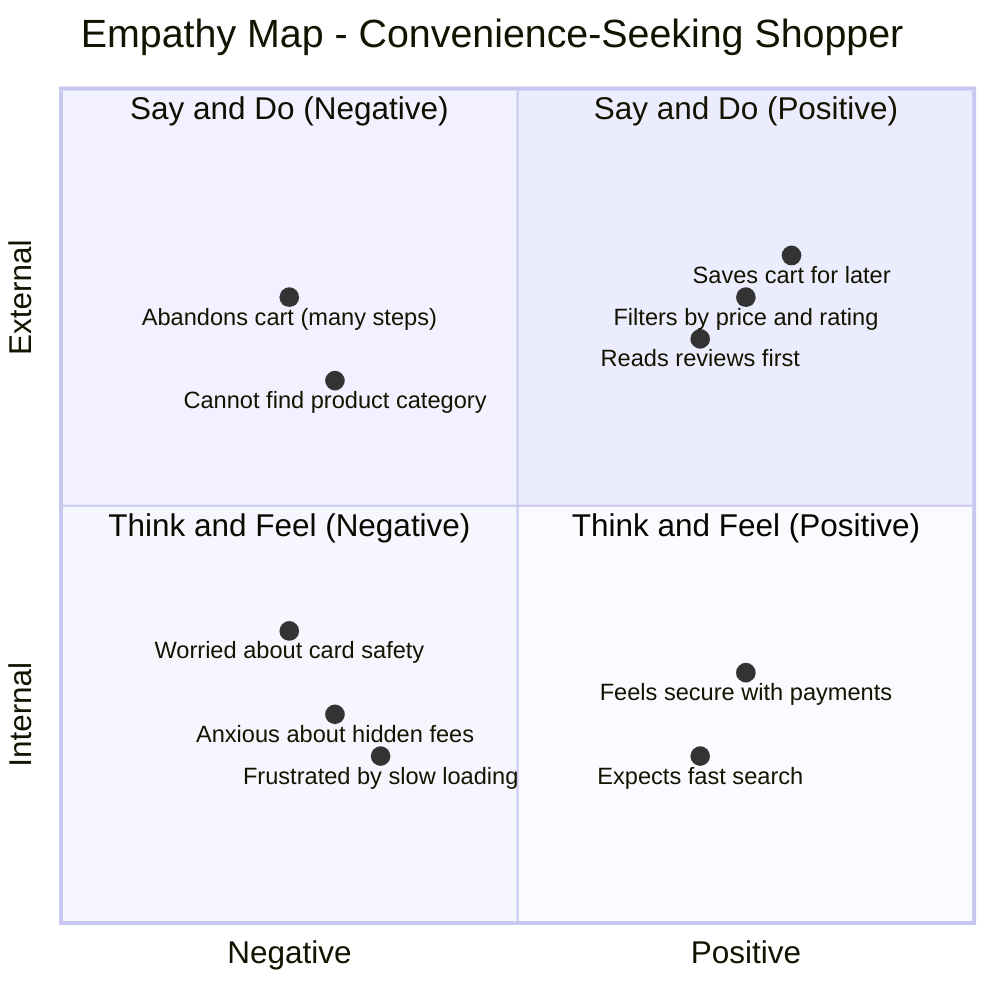

# Empathy Map Canvas

**Document Version**: 1.1
**Date**: 11 June 2026
**Project Name**: ShopEZ — MERN Stack E-commerce Application
**Phase**: Brainstorming & Ideation

---

## 1. Introduction

This document presents the **Empathy Map Canvas** for the two primary user personas of the ShopEZ platform. Empathy mapping is a collaborative tool used to articulate a deep understanding of the target users' mental models, motivations, pain points, and desired gains — ensuring that design and development decisions remain grounded in genuine user needs.

---

## 2. Persona 1 — "The Convenience-Seeking Shopper"

**Profile**: Urban professional, 24–40 years of age, technologically proficient, shops online 3–6 times per month across devices (mobile and desktop).

### 2.1 Empathy Map

### 2.2 Detailed Dimension Analysis

#### Think & Feel
- *"I hope this website is genuinely secure with my credit card information."*
- *"I need to find what I'm looking for within the first two minutes — otherwise, I'm leaving."*
- Experiences anxiety regarding undisclosed shipping fees appearing at the final checkout step.
- Feels a sense of relief and increased purchase confidence when product pages feature high-resolution images, verified reviews, and clear stock indicators.

#### Hear
- *"You should try this platform — it delivered within 48 hours and the return process was effortless."*
- *"Always check the reviews before committing to a purchase."*
- *"Is the payment integration secure? Did they even verify with a payment gateway?"*
- Peer recommendations heavily influence first-time platform adoption.

#### See
- Competitor platforms with cluttered, information-dense product listing pages.
- Retargeted advertisements across social media for items previously viewed.
- Clean, modern, mobile-first interfaces on market-leading e-commerce platforms.
- Inconsistent typography, colour usage, and layout on less-polished competitors.

#### Say & Do
- *"I'll add this to my cart and complete the purchase on my laptop later tonight."*
- *"I cannot locate the exact category I need — the navigation is confusing."*
- Frequently abandons the checkout flow when it requires more than three steps.
- Habitually applies price and rating filters before browsing product listings.
- Reads a minimum of five reviews before committing to a purchase above ₹500.

#### Pains
- Significant loading delays, particularly on product listing and image-heavy pages.
- Loss of cart items upon session expiry or when switching between devices.
- Unnecessarily complicated return/refund and order-tracking procedures.
- Unexpected charges appearing at the final step of checkout.

#### Gains
- Time saved through a streamlined, guided checkout process (Address → Payment → Confirm).
- Peace of mind derived from a trusted, recognisable payment gateway integration.
- High satisfaction when the search and filter system surfaces exactly what is needed within seconds.

---

## 3. Persona 2 — "The Operationally-Stretched Store Administrator"

**Profile**: Small-to-medium business owner, 30–50 years of age, moderate technical proficiency, manages day-to-day store operations including inventory, pricing, and customer order fulfilment.

### 3.1 Detailed Dimension Analysis

#### Think & Feel
- *"I need to know, at a glance, how much revenue was generated this month versus last."*
- *"Updating product images takes far too long — I need a faster image upload process."*
- Feels overwhelmed when order status updates require navigating multiple disconnected screens.
- Concerned about stock accuracy — fears overselling when checkout and inventory are not synchronised in real-time.

#### Hear
- *"You need a dashboard that shows your numbers clearly — not buried in spreadsheets."*
- *"Customers are complaining that product images are low quality and take ages to load."*
- *"You should be able to add a product in under two minutes."*

#### See
- Competitors using integrated admin panels with real-time analytics widgets.
- Their own sales data trapped in manual spreadsheet exports.
- E-commerce SaaS platforms with high monthly subscription costs.

#### Say & Do
- *"Every time I upload a new product, I need to manually resize and host the images."*
- *"I have no way to see which products are underperforming."*
- Spends disproportionate time on repetitive admin tasks that should be automated.
- Delays fulfilling orders because the order list interface is difficult to parse.

#### Pains
- No centralised dashboard presenting aggregated sales metrics and order statuses.
- Image management is a significant operational bottleneck.
- Inability to quickly identify low-stock items before they go out of stock.

#### Gains
- A dedicated, secure `/admin` panel with role-protected access.
- Cloudinary-powered image uploads that auto-optimise and serve via CDN.
- Sales analytics (monthly revenue charts, order volume trends) at a glance.
- One-click order status updates (Processing → Shipped → Delivered).

---

## 4. Conclusion

The empathy maps for both personas reveal a shared underlying theme: the demand for **speed, trust, and operational efficiency**. These insights directly shape the feature prioritisation in the *Brainstorming* and *Requirement Analysis* documents. Every platform feature should be evaluated against its contribution to resolving at least one documented Pain or enabling at least one documented Gain.

---
*Document controlled by V S S S Manikanta — June 2026*
