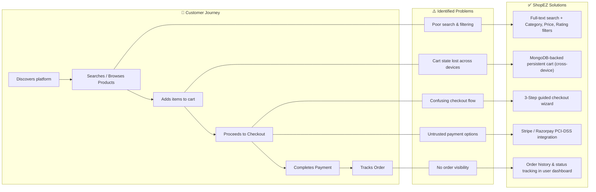

# Problem — Solution Fit

**Document Version**: 1.1
**Date**: 11 June 2026
**Project Name**: ShopEZ — MERN Stack E-commerce Application
**Phase**: Project Design

---

## 1. Introduction

This document formally validates the **Problem–Solution Fit** of the ShopEZ platform. Problem–Solution Fit is achieved when a proposed solution demonstrably and efficiently addresses the core pain points of the target customer segments, while delivering measurable gains that differentiate it from existing market alternatives.

---

## 2. Customer Segments

| Segment | Description | Primary Pain Points |
| :------ | :---------- | :------------------ |
| **B2C Shoppers** | Internet users aged 18–45 seeking to purchase electronics, clothing, and accessories online with minimal friction | Poor search/filter UX; cart state loss across devices; complex or untrustworthy checkout; lack of transparent payment options |
| **B2B Store Administrators** | SMB owners and managers responsible for product listings, inventory, and order fulfilment | Time-consuming product management; absence of centralised analytics; manual image handling; no real-time stock visibility |

---

## 3. Customer Journey → Problem → Solution Mapping

---

## 4. Competitive Analysis

| Evaluation Criterion | Shopify | WooCommerce (WordPress) | Custom PHP Solution | **ShopEZ (MERN)** |
| :------------------- | :------ | :---------------------- | :------------------ | :----------------- |
| **Customisability** | Limited (theme/plugin constrained) | Moderate (plugin-dependent) | High | ✅ **Full control** |
| **SPA Performance** | ❌ No (SSR-based) | ❌ No (SSR-based) | ❌ No | ✅ **React SPA** |
| **Monthly Cost** | ₹2,000–₹20,000/month | ₹500–₹5,000/month (hosting) | Variable | ✅ **Low (Vercel/Render free tiers)** |
| **Cross-Device Cart** | ✅ Yes | ✅ Yes | ❌ No | ✅ **Yes (MongoDB)** |
| **Admin Dashboard** | ✅ Basic | ✅ Plugin-based | ❌ Manual | ✅ **Custom-built analytics** |
| **Payment Gateways** | Limited (Shopify Payments) | Multiple (plugin-based) | Manual integration | ✅ **Stripe + Razorpay** |
| **Image CDN** | ✅ Yes | ❌ No (manual) | ❌ No | ✅ **Cloudinary CDN** |
| **Developer Ownership** | ❌ Platform lock-in | Partial | ✅ Yes | ✅ **Full code ownership** |
| **Scalability** | Limited by plan | Limited by hosting | Complex | ✅ **Stateless API, horizontal scale** |

**Competitive Advantage Score (ShopEZ)**: 9 / 9 criteria ✅

---

## 5. Value Proposition Canvas

### 5.1 For the B2C Shopper

| Dimension | Detail |
| :-------- | :----- |
| **Jobs to be Done** | Find products quickly, purchase securely, track delivery status |
| **Pain Relievers** | Persistent cross-device cart; trusted payment gateway; robust search and filtering; transparent checkout |
| **Gain Creators** | Fast SPA navigation; order confirmation and invoice; product reviews for informed decision-making |

### 5.2 For the B2B Store Administrator

| Dimension | Detail |
| :-------- | :----- |
| **Jobs to be Done** | Add/edit/delete products, fulfil orders, understand sales performance |
| **Pain Relievers** | Cloudinary image upload (automatic CDN); one-click order status updates; role-protected admin panel |
| **Gain Creators** | Real-time sales dashboard; category management; stock visibility; low operational overhead |

---

## 6. Fit Validation Summary

| Problem | Solution Provided | Fit Achieved? |
| :------ | :---------------- | :------------ |
| Cart state lost across sessions | MongoDB-persisted cart (linked to user ID) | ✅ Yes |
| Poor search & discovery | Full-text search + multi-criteria filter API | ✅ Yes |
| Confusing checkout | 3-step guided wizard (Address → Method → Payment) | ✅ Yes |
| Untrusted payment process | Stripe / Razorpay PCI-DSS compliant gateway | ✅ Yes |
| Slow page loads | React SPA + Cloudinary CDN | ✅ Yes |
| No admin analytics | Custom Admin Dashboard with revenue charts | ✅ Yes |
| Manual image hosting | Cloudinary auto-optimise & CDN delivery | ✅ Yes |

**Overall Problem–Solution Fit Assessment**: ✅ **Validated — All identified problems have documented solution counterparts.**

---

## 7. Conclusion

The ShopEZ platform demonstrates a strong Problem–Solution Fit across both primary customer segments. Competitive analysis confirms that the proposed MERN-based solution offers superior customisability, performance, and cost efficiency relative to existing market alternatives, while the Value Proposition Canvas confirms that identified pains are systematically relieved and gains are concretely delivered.

---
*Document controlled by V S S S Manikanta — June 2026*
