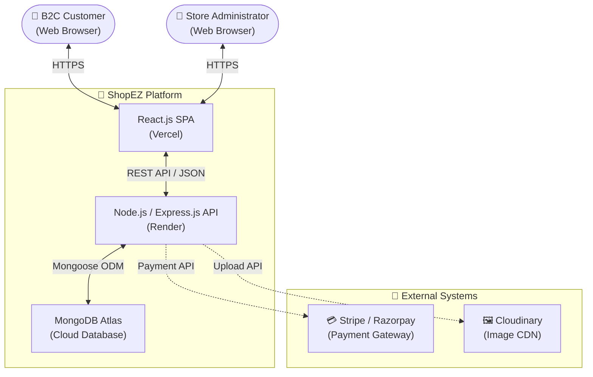

# Proposed Solution

**Document Version**: 1.1
**Date**: 11 June 2026
**Project Name**: ShopEZ — MERN Stack E-commerce Application
**Phase**: Project Design

---

## 1. Introduction

This document formally defines the proposed solution for the ShopEZ e-commerce platform. The solution has been designed in direct response to the validated problem statements and requirements established in the Brainstorming, Requirement Analysis, and Problem–Solution Fit documents.

---

## 2. System Context Diagram

The following diagram presents a C4 Model — Level 1 (System Context) view of the ShopEZ platform, illustrating its boundaries and relationships with external actors and systems.

---

## 3. Proposed Solution Parameters

| S.No. | Parameter | Detailed Description |
| :---- | :-------- | :------------------- |
| **1** | **Problem Statement** | Customers require a secure, fast, and intuitive platform to discover and purchase items online. Simultaneously, administrators require a centralised, efficient tool to manage product inventory, monitor sales performance, and fulfil customer orders in a timely manner. The core gap is the absence of a unified, modern, customisable e-commerce solution accessible without prohibitive SaaS subscription costs. |
| **2** | **Idea / Solution Description** | Develop a fully responsive Single Page Application (SPA) using the **MERN stack** (MongoDB, Express.js, React.js, Node.js). The platform provides: (i) a customer-facing storefront with robust product discovery, persistent cart, and guided checkout; and (ii) an administrator panel with inventory management, order fulfilment controls, Cloudinary-powered image uploads, and sales analytics dashboards. Payment processing is delegated to PCI-DSS compliant third-party gateways (Stripe / Razorpay) to eliminate the liability of storing financial data on the platform server. |
| **3** | **Novelty / Uniqueness** | The ShopEZ platform distinguishes itself through the following architectural and experiential differentiators: (i) **Decoupled Architecture**: The React frontend and Node.js API operate as entirely independent deployable units, enabling independent scaling and technology evolution; (ii) **Cross-Device Cart Persistence**: Unlike session-storage-based implementations, cart state is persisted in MongoDB and linked to the authenticated user, surviving browser closures and device changes; (iii) **Cloudinary Dynamic Transformations**: Product images are automatically compressed and converted to WebP format on CDN delivery, without any server-side processing overhead; (iv) **Stateless JWT Authentication**: Horizontal API scaling is achievable without the complexity of shared session management infrastructure. |
| **4** | **Social Impact / Customer Satisfaction** | The platform delivers a reliable, transparent purchasing process that builds consumer trust through secure payment integration, clear order tracking, and genuine product review visibility. For small and medium-sized business operators, the accessible analytics tooling enables data-driven inventory decisions and customer service improvements — empowering businesses that previously lacked the technical resources to operate professionally in digital commerce. |
| **5** | **Business Model (Revenue Model)** | The primary revenue model is transactional: revenue is generated through direct sales margins on products listed on the platform. Secondary monetisation opportunities include: (i) premium product placement and featured listing slots for vendors; (ii) a percentage-based commission model if the platform is extended to a multi-vendor marketplace configuration in a future release; (iii) shipping and handling fee collection on high-volume orders. |

---

## 4. High-Level Feature Summary

| Feature Category | Key Capabilities |
| :--------------- | :--------------- |
| **Authentication & Security** | JWT + Bcrypt; HTTP-only cookie sessions; RBAC (User / Admin) |
| **Product Discovery** | Full-text search; Category, Price, Rating filters; Sorting |
| **Shopping Experience** | Persistent cart; Real-time total calculation; Stock validation |
| **Checkout & Payment** | 3-step wizard; Stripe / Razorpay integration; Invoice generation |
| **Order Management** | Order history (customer); Order fulfilment status (admin) |
| **Product Reviews** | Verified purchase reviews; Aggregate rating recalculation |
| **Admin Operations** | Product CRUD; Category management; Cloudinary image upload |
| **Admin Analytics** | Revenue charts; Order volume metrics; User growth indicators |

---

## 5. Conclusion

The proposed ShopEZ solution is a well-defined, architecturally sound, and commercially viable response to the validated problem landscape. Its MERN-based implementation provides the development team with full code ownership, high customisability, and a production-ready deployment configuration on cloud infrastructure — without the recurring cost constraints of proprietary SaaS e-commerce platforms.

---
*Document controlled by V S S S Manikanta — June 2026*
