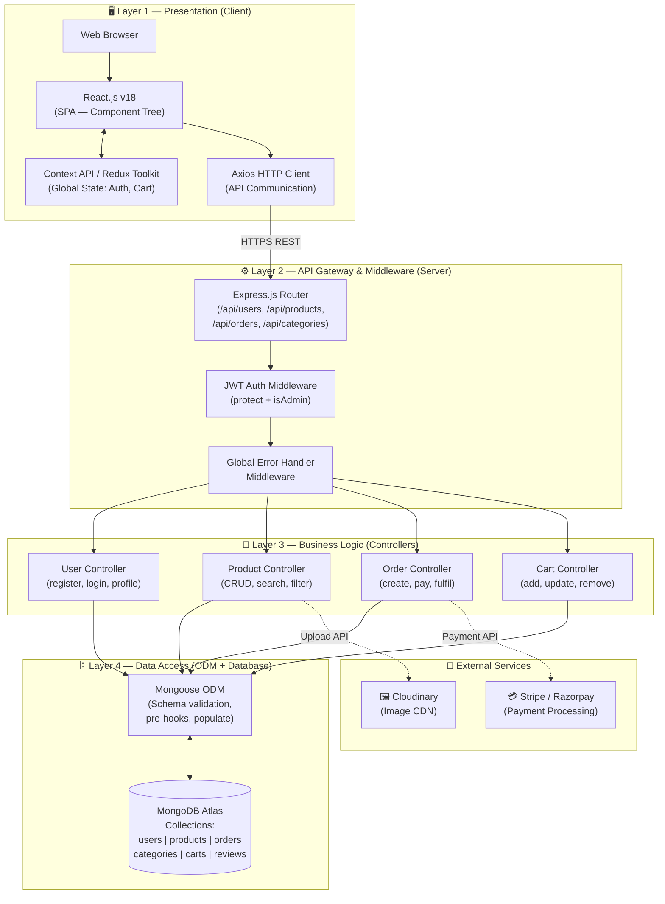
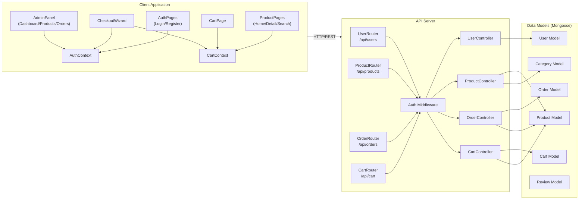
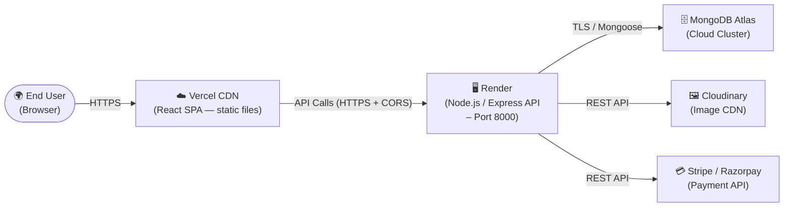

# Solution Architecture

**Document Version**: 1.1
**Date**: 11 June 2026
**Project Name**: ShopEZ — MERN Stack E-commerce Application
**Phase**: Project Design

---

## 1. Introduction

This document provides a comprehensive specification of the **Solution Architecture** for the ShopEZ platform. It covers the layered system architecture, component relationships, the MVC design pattern mapping, the database entity model, and the deployment topology. The architecture adheres to the principles of **Separation of Concerns**, **Stateless API Design**, and **Scalable Cloud Deployment**.

---

## 2. Layered System Architecture

The ShopEZ platform is structured across four distinct architectural layers. The following diagram illustrates the complete system and the data flow between layers:

---

## 3. MVC Design Pattern Mapping

The ShopEZ backend strictly adheres to the **Model–View–Controller (MVC)** architectural pattern, adapted for a decoupled API-first design:

| MVC Layer | MERN Component | Responsibilities |
| :-------- | :------------- | :--------------- |
| **View** | React.js (Frontend SPA) | Renders UI components; manages local component state; dispatches API calls via Axios; updates global state via Context/Redux |
| **Controller** | Express.js Controllers | Receives validated HTTP requests; orchestrates business logic; invokes Model methods; formats and returns JSON responses |
| **Model** | Mongoose Schemas & Models | Defines data structure, validation rules, and type constraints; executes lifecycle hooks (password hashing, timestamp management); interfaces with MongoDB Atlas |

---

## 4. UML Component Diagram

---

## 5. Database Entity Overview

The following entities are defined as Mongoose schemas and persisted as MongoDB collections:

| Entity (Collection) | Key Fields | Relationships |
| :------------------ | :--------- | :------------ |
| **User** | `_id`, `name`, `email` (unique), `password` (hashed), `role` (user/admin), `addresses[]` | References: Orders, Cart, Reviews |
| **Product** | `_id`, `name`, `description`, `price`, `stock`, `images[]`, `rating`, `numReviews`, `category` (FK), `seller` (FK) | References: Category, Reviews, OrderItems, CartItems |
| **Category** | `_id`, `name` (unique), `slug` (unique), `description`, `image` | Referenced by: Products |
| **Order** | `_id`, `user` (FK), `orderItems[]`, `shippingAddress`, `paymentMethod`, `paymentResult`, `totalPrice`, `isPaid`, `isDelivered`, `orderStatus` | References: User, Products |
| **Cart** | `_id`, `user` (FK, unique), `items[]` (product FK, quantity, price), `updatedAt` | References: User, Products |
| **Review** | `_id`, `user` (FK), `product` (FK), `rating`, `comment`, `createdAt` | References: User, Products |

---

## 6. API Endpoint Architecture

| Method | Endpoint | Auth Required | Role | Description |
| :----- | :------- | :------------ | :--- | :---------- |
| POST | `/api/users/register` | No | — | Register a new user account |
| POST | `/api/users/login` | No | — | Authenticate user and issue JWT |
| GET | `/api/users/profile` | Yes | User | Retrieve authenticated user profile |
| PUT | `/api/users/profile` | Yes | User | Update user profile |
| GET | `/api/products` | No | — | Fetch all products (supports query filters) |
| GET | `/api/products/:id` | No | — | Fetch single product by ID |
| POST | `/api/products` | Yes | Admin | Create a new product listing |
| PUT | `/api/products/:id` | Yes | Admin | Update product details |
| DELETE | `/api/products/:id` | Yes | Admin | Remove a product listing |
| POST | `/api/orders` | Yes | User | Place a new order |
| GET | `/api/orders/myorders` | Yes | User | Retrieve authenticated user's order history |
| GET | `/api/orders/:id` | Yes | User/Admin | Retrieve a specific order by ID |
| PUT | `/api/orders/:id/pay` | Yes | User | Mark order as paid (after gateway confirmation) |
| PUT | `/api/orders/:id/deliver` | Yes | Admin | Update order delivery status |

---

## 7. Deployment Topology

| Component | Platform | URL |
| :-------- | :------- | :-- |
| **Frontend (React SPA)** | Vercel | `https://e-commerce-application-neon-five.vercel.app/` |
| **Backend (Node.js API)** | Render | `https://shopez-api-c30e.onrender.com` |
| **Database** | MongoDB Atlas | Cloud-hosted (M0 Free Tier) |
| **Image Storage** | Cloudinary | CDN delivery via `res.cloudinary.com` |

---

## 8. Conclusion

The ShopEZ solution architecture delivers a well-structured, layered, and cloud-native platform. The strict separation of concerns across Presentation, API, Business Logic, and Data Access layers ensures the system is maintainable, independently scalable, and extendable. The MVC pattern provides a clear organisational framework for all backend code, while the decoupled frontend–backend deployment model enables independent versioning and continuous delivery.

---
*Document controlled by V S S S Manikanta — June 2026*
