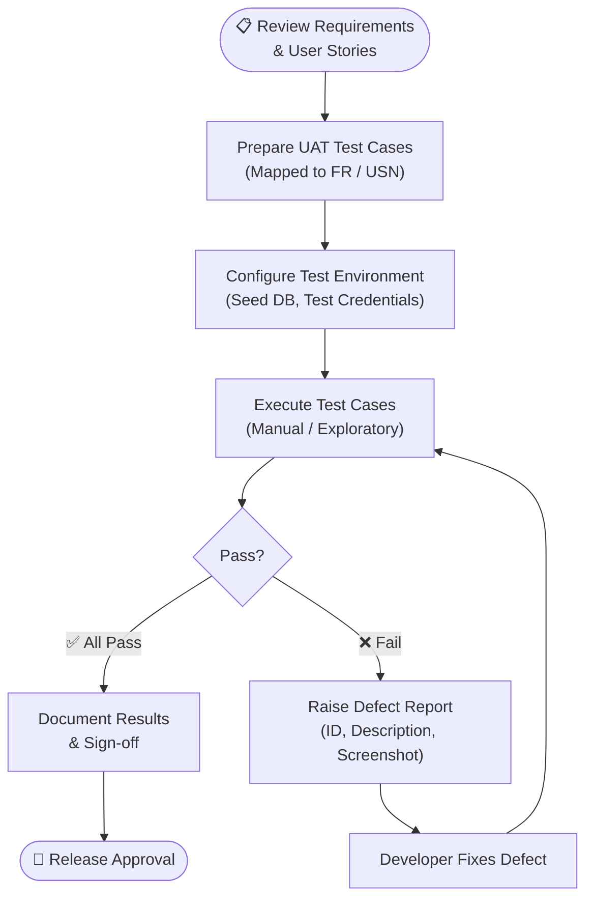

# User Acceptance Testing (UAT)

**Document Version**: 1.1
**Date**: 11 June 2026
**Project Name**: ShopEZ — MERN Stack E-commerce Application
**Phase**: Project Development

---

## 1. Introduction

This document defines the **User Acceptance Testing (UAT)** strategy, process, and test cases for the ShopEZ platform. UAT is the final validation phase conducted to confirm that the delivered system meets the business requirements and is ready for production release. Test cases are mapped directly to User Stories (USN) and Functional Requirements (FR) to ensure complete traceability.

**Live Application URL**: `https://e-commerce-application-neon-five.vercel.app/`
**Test Environment**: Chrome v120+ / Edge v120+ (desktop and mobile viewports)

---

## 2. UAT Process Flow

---

## 3. Test Credentials

| Role | Email | Password |
| :--- | :---- | :------- |
| **Administrator** | `admin@shopez.com` | `adminpassword123` |
| **Customer** | `test@email.com` | `password123` |
| **New Registration** | *Register via UI* | *Self-defined* |

---

## 4. UAT Test Cases

### 4.1 Authentication Module

| Test ID | User Story | Scenario / Feature | Steps to Execute | Expected Result | Actual Result | Status |
| :------ | :--------- | :----------------- | :--------------- | :-------------- | :------------ | :----- |
| **UAT-001** | USN-1 | New User Registration | 1. Navigate to `/register`. 2. Enter valid name, email, and password. 3. Click "Sign Up". | Account is created; user is redirected to the dashboard; "Welcome" toast notification appears. | | ☐ Pass / Fail |
| **UAT-002** | USN-1 | Duplicate Email Rejection | 1. Navigate to `/register`. 2. Enter an already-registered email. 3. Submit. | System returns error: *"User already exists."* Registration is prevented. | | ☐ Pass / Fail |
| **UAT-003** | USN-2 | Valid User Login | 1. Navigate to `/login`. 2. Enter valid credentials. 3. Click "Sign In". | JWT session is established; user is redirected to the homepage; Navbar shows user avatar/name. | | ☐ Pass / Fail |
| **UAT-004** | USN-2 | Invalid Credentials Rejection | 1. Navigate to `/login`. 2. Enter an incorrect password. 3. Submit. | System returns HTTP 401; error message: *"Invalid email or password."* | | ☐ Pass / Fail |

### 4.2 Product Discovery Module

| Test ID | User Story | Scenario / Feature | Steps to Execute | Expected Result | Actual Result | Status |
| :------ | :--------- | :----------------- | :--------------- | :-------------- | :------------ | :----- |
| **UAT-005** | USN-3 | Keyword Product Search | 1. Navigate to `/`. 2. Enter "Shirt" in the search bar. 3. Press Enter. | Only products whose name or description contains "Shirt" are displayed. | | ☐ Pass / Fail |
| **UAT-006** | USN-3 | Category & Price Filter | 1. On the product listing page, select Category = "Electronics" and set Price Range to ₹500–₹5,000. | Only products within the Electronics category and specified price range are displayed. | | ☐ Pass / Fail |
| **UAT-007** | USN-3 | Sort by Price Ascending | 1. On the product listing page, select Sort = "Price: Low to High". | Products are re-ordered with the lowest-priced items appearing first. | | ☐ Pass / Fail |

### 4.3 Shopping Cart Module

| Test ID | User Story | Scenario / Feature | Steps to Execute | Expected Result | Actual Result | Status |
| :------ | :--------- | :----------------- | :--------------- | :-------------- | :------------ | :----- |
| **UAT-008** | USN-4 | Add Product to Cart | 1. Open any product detail page. 2. Select quantity = 2. 3. Click "Add to Cart". | Cart badge increments; cart modal/page shows the item with correct quantity and total. | | ☐ Pass / Fail |
| **UAT-009** | USN-4 | Update Cart Quantity | 1. Open the Cart page. 2. Change the quantity of an item. | Cart subtotal and item quantity update in real time; no page reload required. | | ☐ Pass / Fail |
| **UAT-010** | USN-4 | Remove Item from Cart | 1. Open the Cart page. 2. Click "Remove" on an item. | Item is removed; total is recalculated; if cart is empty, an "Empty Cart" message is displayed. | | ☐ Pass / Fail |

### 4.4 Checkout & Payment Module

| Test ID | User Story | Scenario / Feature | Steps to Execute | Expected Result | Actual Result | Status |
| :------ | :--------- | :----------------- | :--------------- | :-------------- | :------------ | :----- |
| **UAT-011** | USN-5 / USN-6 | Full Checkout Flow | 1. Add item to cart. 2. Click "Proceed to Checkout". 3. Enter shipping address. 4. Select payment method. 5. Enter Stripe test card `4242 4242 4242 4242`. 6. Place order. | Order is created in the database; product stock is deducted; order confirmation page with invoice is displayed; order appears in user's order history. | | ☐ Pass / Fail |
| **UAT-012** | USN-6 | Payment Failure Handling | 1. At payment step, enter Stripe test card `4000 0000 0000 9995` (card declined). | Payment failure is gracefully handled; user sees an error message; order is NOT created; stock is NOT deducted. | | ☐ Pass / Fail |

### 4.5 Admin Operations Module

| Test ID | User Story | Scenario / Feature | Steps to Execute | Expected Result | Actual Result | Status |
| :------ | :--------- | :----------------- | :--------------- | :-------------- | :------------ | :----- |
| **UAT-013** | USN-8 | Admin Product Creation | 1. Log in as Admin. 2. Navigate to Admin → Products → "Create New". 3. Fill all product fields and upload an image. 4. Submit. | Product appears immediately in the public catalogue; image is served via Cloudinary CDN URL. | | ☐ Pass / Fail |
| **UAT-014** | USN-8 | Admin Product Update | 1. Log in as Admin. 2. Open an existing product. 3. Edit the price and description. 4. Save. | Updated product details are reflected on the public product detail page. | | ☐ Pass / Fail |
| **UAT-015** | USN-9 | Admin Order Status Update | 1. Log in as Admin. 2. Navigate to Admin → Orders. 3. Select an order with status "Processing". 4. Update to "Shipped". | Order status in the database is updated; the change is reflected in the customer's order history page. | | ☐ Pass / Fail |
| **UAT-016** | USN-8 | Unauthorised Admin Access Rejection | 1. Log in as a standard Customer. 2. Attempt to navigate to `/admin` directly. | System redirects the customer away from the admin panel; access is denied with an appropriate error. | | ☐ Pass / Fail |

---

## 5. UAT Results Summary

| Module | Total Tests | Passed | Failed | Pass Rate |
| :----- | :---------- | :----- | :----- | :-------- |
| Authentication | 4 | | | |
| Product Discovery | 3 | | | |
| Shopping Cart | 3 | | | |
| Checkout & Payment | 2 | | | |
| Admin Operations | 4 | | | |
| **Total** | **16** | | | |

---

## 6. UAT Sign-Off

| Role | Name | Signature | Date |
| :--- | :--- | :-------- | :--- |
| Development Lead | | | |
| QA Reviewer | | | |
| Product Owner / Stakeholder | | | |

**Acceptance Statement**: *We confirm that the ShopEZ application has been tested against all defined User Acceptance criteria and is approved for production release.*

---
*Document controlled by V S S S Manikanta — June 2026*
