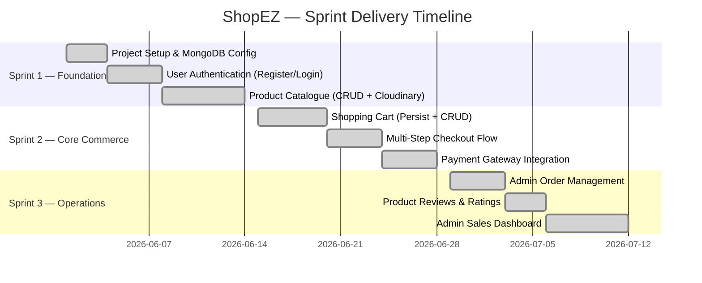
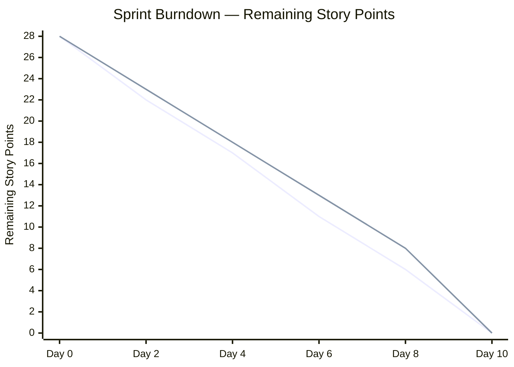

# Project Planning

**Document Version**: 1.1
**Date**: 11 June 2026
**Project Name**: ShopEZ — MERN Stack E-commerce Application
**Phase**: Project Planning

---

## 1. Introduction

This document formalises the project planning artefacts for the ShopEZ development initiative. It encompasses the Product Backlog, Sprint Schedule with Story Point estimates, a Sprint Timeline (Gantt Chart), Velocity Tracking, Burndown Analysis, and a Risk Register. The planning framework adopted is **Scrum-based Agile**, executed in three two-week sprints.

---

## 2. Product Backlog & Sprint Schedule

| Sprint | Epic | USN | User Story / Task | Story Points | Priority | Status |
| :----- | :--- | :-- | :---------------- | :----------- | :------- | :----- |
| Sprint 1 | Project Setup & DB | USN-0 | Initialise React frontend, Node.js backend, and configure MongoDB Atlas models | 3 | 🔴 High | ✅ Done |
| Sprint 1 | User Authentication | USN-1 | As a user, I can register with email, name, and password and receive a JWT session | 2 | 🔴 High | ✅ Done |
| Sprint 1 | User Authentication | USN-2 | As a user, I can log in with credentials and be granted a JWT stored in an HTTP-only cookie | 2 | 🔴 High | ✅ Done |
| Sprint 1 | Product Catalogue | USN-3 | As an admin, I can create, edit, and delete product listings with Cloudinary image uploads | 3 | 🔴 High | ✅ Done |
| Sprint 2 | Shopping Cart | USN-4 | As a user, I can add items to my cart, update quantities, and have my cart persist across devices | 3 | 🔴 High | ✅ Done |
| Sprint 2 | Checkout Flow | USN-5 | As a user, I can complete a 3-step checkout (Address → Payment Method → Confirm Order) | 3 | 🔴 High | ✅ Done |
| Sprint 2 | Payment Integration | USN-6 | As a user, I can pay via an integrated Payment Gateway (Stripe / Razorpay) and receive order confirmation | 5 | 🔴 High | ✅ Done |
| Sprint 3 | Order Management | USN-7 | As an admin, I can view all orders and update their delivery status (Processing → Shipped → Delivered) | 2 | 🟡 Medium | ✅ Done |
| Sprint 3 | Product Reviews | USN-8 | As a user, I can leave a verified review and star rating on a purchased product | 2 | 🟡 Medium | ✅ Done |
| Sprint 3 | Admin Dashboard | USN-9 | As an admin, I can view monthly revenue charts and sales metric summaries | 3 | 🟡 Medium | ✅ Done |

---

## 3. Sprint Timeline — Gantt Chart

---

## 4. Velocity & Project Tracker

| Sprint | Total Story Points | Planned Start | Planned End | Points Completed | Completion Rate |
| :----- | :----------------- | :------------ | :---------- | :--------------- | :-------------- |
| Sprint 1 | 10 | 01 June 2026 | 14 June 2026 | 10 | 100% ✅ |
| Sprint 2 | 11 | 15 June 2026 | 28 June 2026 | 11 | 100% ✅ |
| Sprint 3 | 7  | 29 June 2026 | 12 July 2026 | 7  | 100% ✅ |
| **Total** | **28** | — | — | **28** | **100% ✅** |

- **Average Velocity**: 9.3 Story Points per Sprint
- **Sprint Duration**: 2 Weeks (10 working days per sprint)
- **Total Project Duration**: 6 Weeks (3 Sprints)

---

## 5. Burndown Chart Analysis

*Note: The solid line represents actual burn rate; the dashed line represents the ideal linear burn-rate target.*

**Analysis**: The team maintained a consistent delivery pace throughout the project lifecycle. No sprint experienced significant deviation from the ideal burn-down trajectory. The highest complexity sprint (Sprint 2, 11 points) was completed on schedule, owing to the early-sprint completion of the Shopping Cart implementation, which allowed parallel development of the Payment Gateway integration in the final days.

---

## 6. Risk Register

| Risk ID | Risk Description | Probability | Impact | Severity | Mitigation Strategy |
| :------ | :--------------- | :---------- | :----- | :------- | :------------------ |
| R-01 | Payment gateway API downtime during testing | Medium | High | 🔴 High | Use Stripe test mode (`sk_test_*`); maintain fallback mock payment handler |
| R-02 | MongoDB Atlas connection failure in production | Low | High | 🟡 Medium | Configure automatic reconnect logic; monitor via Atlas alerts |
| R-03 | Cloudinary storage limit exceeded | Low | Medium | 🟢 Low | Set file size limits in upload middleware; configure Cloudinary usage alerts |
| R-04 | JWT secret key exposed via public repository | Low | Critical | 🔴 Critical | Store all secrets in `.env` (git-ignored); enforce secret scanning in CI/CD |
| R-05 | Cart state desync on concurrent multi-device login | Medium | Medium | 🟡 Medium | Implement server-side cart reconciliation on login; use updatedAt timestamps |
| R-06 | React build size impacting initial load time | Medium | Medium | 🟡 Medium | Implement code-splitting with `React.lazy()`; enable Gzip compression on server |

---

## 7. Conclusion

The Agile sprint framework provided the development team with a structured, iterative approach to delivery. The three-sprint structure enabled progressive value delivery, with the most critical user-facing features (authentication, catalogue, and checkout) delivered in the earliest sprints. All 28 story points were completed within the planned six-week timeline.

---
*Document controlled by V S S S Manikanta — June 2026*
