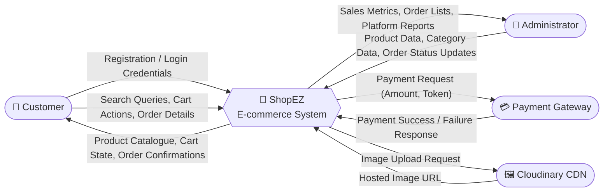
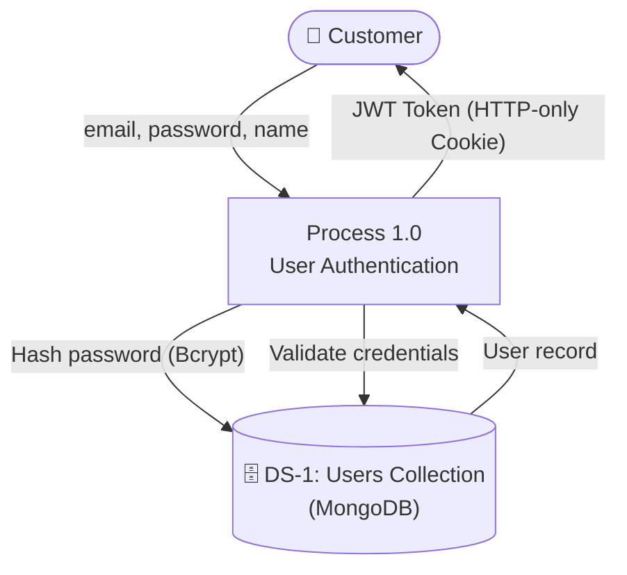
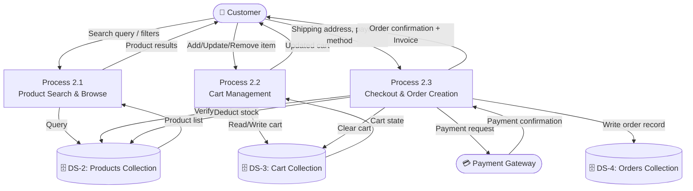
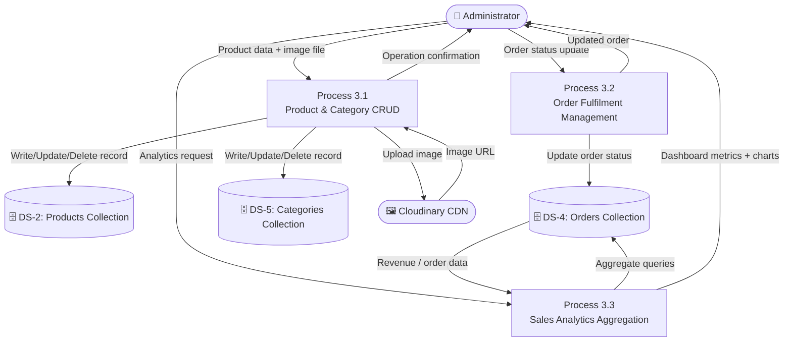

# Data Flow Diagrams and User Stories

**Document Version**: 1.1
**Date**: 11 June 2026
**Project Name**: ShopEZ — MERN Stack E-commerce Application
**Phase**: Requirement Analysis

---

## 1. Introduction

This document presents the **Data Flow Diagrams (DFDs)** and formal **User Stories** for the ShopEZ platform. The DFDs model the system at two levels of abstraction — the Context Level (Level 0) and the Functional Decomposition Level (Level 1) — illustrating how data flows between the system's actors, processes, and data stores. User Stories are subsequently defined to specify system behaviour from the end-user's perspective.

---

## 2. Data Flow Diagrams

### 2.1 Level 0 — Context Diagram

The Level 0 Context Diagram presents the ShopEZ system as a single process ("black box"), illustrating only the external entities and the high-level data flows between them and the system.

---

### 2.2 Level 1 — Functional Decomposition

The Level 1 DFD decomposes the ShopEZ system into its three core sub-processes, showing data flows between each process and the underlying data stores.

#### Sub-Process 1: Authentication

#### Sub-Process 2: Shopping & Order Placement

#### Sub-Process 3: Administration

---

## 3. User Stories

| User Type | Epic | USN | User Story | Acceptance Criteria | Story Points | Priority | Sprint |
| :-------- | :--- | :-- | :--------- | :------------------ | :----------- | :------- | :----- |
| **Customer** | Registration | USN-1 | As a customer, I can register by entering my name, email, and password so that I can access personalised features. | User account is created in the database; user is redirected to the dashboard upon success; duplicate email returns HTTP 400. | 2 | 🔴 High | Sprint 1 |
| **Customer** | Login | USN-2 | As a customer, I can log in using my registered email and password so that I can securely access my account. | System validates credentials; a JWT token is issued and stored in an HTTP-only cookie; incorrect credentials return HTTP 401. | 2 | 🔴 High | Sprint 1 |
| **Customer** | Browsing | USN-3 | As a customer, I can search for products by keyword and filter results by category, price range, and star rating so that I can efficiently find relevant items. | Search results accurately reflect the applied search term and filters; results update dynamically without full page reload. | 3 | 🔴 High | Sprint 1 |
| **Customer** | Shopping Cart | USN-4 | As a customer, I can add products to my cart, adjust quantities, and remove items so that I can manage my intended purchase. | Cart total updates in real time; cart state persists across page reloads and device sessions; out-of-stock items cannot be added. | 3 | 🔴 High | Sprint 2 |
| **Customer** | Checkout | USN-5 | As a customer, I can complete a guided checkout by entering my shipping address and selecting a payment method so that I can place an order. | All three checkout steps are navigable; order is created upon placement; shipping address is validated before proceeding. | 3 | 🔴 High | Sprint 2 |
| **Customer** | Payment | USN-6 | As a customer, I can securely pay for my order via an integrated payment gateway so that my transaction is processed without storing sensitive card data on the server. | Payment is processed via the gateway; order status changes to "Paid"; product stock is deducted; order confirmation is displayed. | 5 | 🔴 High | Sprint 2 |
| **Customer** | Reviews | USN-7 | As a customer who has completed a purchase, I can leave a star rating and written review for a product so that other shoppers benefit from my experience. | Review appears on the product detail page; aggregate rating is recalculated; only authenticated users with a prior purchase may review. | 2 | 🟡 Medium | Sprint 3 |
| **Admin** | Catalogue | USN-8 | As an administrator, I can add, edit, and delete product listings including uploading product images so that the storefront catalogue remains accurate and current. | Product changes reflect immediately on the public storefront; images are successfully uploaded to Cloudinary and served via CDN URL. | 3 | 🔴 High | Sprint 1 |
| **Admin** | Orders | USN-9 | As an administrator, I can view all platform orders and update their delivery status so that customers receive timely fulfilment updates. | Status transitions follow the sequence: Processing → Shipped → Delivered; status changes are reflected immediately in the customer's order history. | 2 | 🔴 High | Sprint 3 |
| **Admin** | Dashboard | USN-10 | As an administrator, I can view aggregated sales metrics and monthly revenue charts so that I can make informed business decisions. | Dashboard accurately displays total revenue, total orders, and monthly breakdown; data reflects live database state. | 3 | 🟡 Medium | Sprint 3 |

---

## 4. Conclusion

The Level 0 and Level 1 DFDs provide a comprehensive and unambiguous model of how data traverses the ShopEZ system between its actors, processes, and persistent data stores. The User Stories derived from this analysis constitute the authoritative specification of observable system behaviour, directly traceable to the Sprint Backlog defined in the *Project Planning* document.

---
*Document controlled by V S S S Manikanta — June 2026*
