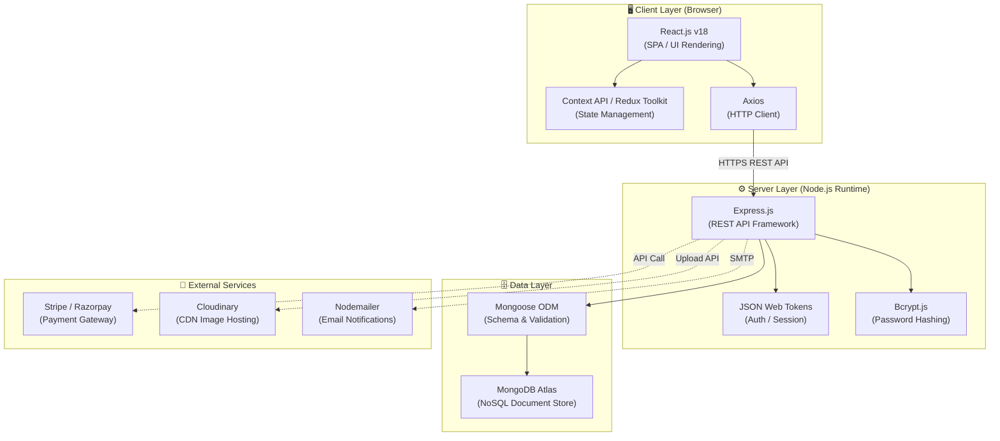

# Technology Stack

**Document Version**: 1.1
**Date**: 11 June 2026
**Project Name**: ShopEZ — MERN Stack E-commerce Application
**Phase**: Requirement Analysis

---

## 1. Introduction

This document provides a formal specification of the technology stack selected for the ShopEZ platform. Each technology selection is accompanied by its architectural role, justification, and a brief Architecture Decision Record (ADR) summarising the decision rationale and the alternatives considered and rejected.

---

## 2. Technology Stack Overview

---

## 3. Detailed Technology Stack Breakdown

| Layer | Technology | Version | Purpose & Justification |
| :---- | :--------- | :------ | :----------------------- |
| **Frontend Framework** | React.js | v18.x | Component-driven Single Page Application (SPA) architecture. Utilises the Virtual DOM for efficient, targeted UI re-rendering. Hooks-based API (`useState`, `useEffect`, `useContext`) enables clean functional component design. |
| **State Management** | Context API / Redux Toolkit | v2.x | Centralised global state management for authentication context, shopping cart, and cached API data. Redux Toolkit reduces boilerplate through `createSlice` and `createAsyncThunk`. |
| **HTTP Client** | Axios | v1.x | Promise-based HTTP client with built-in request/response interceptors, automatic JSON serialisation, and configurable base URL management. Preferred over native `fetch` for its interceptor support and error handling consistency. |
| **Backend Runtime** | Node.js | v18 LTS | JavaScript runtime enabling full-stack development with a single language ecosystem. Non-blocking, event-driven I/O is well-suited for concurrent API request handling. |
| **Backend Framework** | Express.js | v4.x | Minimal, unopinionated Node.js framework providing robust middleware composition, route parameterisation, and structured error handling. Ideal for building RESTful APIs. |
| **Authentication** | JSON Web Tokens (JWT) | RFC 7519 | Stateless, self-contained bearer tokens signed with a server secret. Stored in HTTP-only cookies to mitigate XSS exposure. Enables horizontal API scaling without shared session storage. |
| **Password Security** | Bcrypt.js | v5.x | Industry-standard adaptive hashing algorithm. Salt rounds (≥10) ensure resistance to brute-force and rainbow table attacks. Applied via a Mongoose `pre-save` hook on the User model. |
| **Database** | MongoDB | v6.x (Atlas) | Document-oriented NoSQL database storing flexible, schema-less BSON documents. Supports the dynamic, evolving nature of an e-commerce product catalogue. Hosted on MongoDB Atlas (cloud) for managed backups and auto-scaling. |
| **ODM** | Mongoose | v8.x | Schema-based Object Document Mapper providing validation, type enforcement, virtual fields, populate references, and lifecycle hooks (`pre`, `post`) for MongoDB. |
| **Payment Gateway** | Stripe / Razorpay | Latest | PCI-DSS compliant payment APIs. Stripe handles card payments globally; Razorpay handles Indian UPI, NetBanking, and card payments. No sensitive financial data is stored on the ShopEZ server. |
| **Media Hosting** | Cloudinary | v2.x SDK | Cloud-based media management service. Provides automatic image compression, format conversion (WebP), and CDN delivery. Eliminates local server storage overhead for product images. |
| **Development Tools** | Nodemon, Postman | Latest | Nodemon enables hot-reload for the Node.js server on file changes; Postman is used for API endpoint development, testing, and documentation. |
| **Deployment** | Vercel (Frontend), Render (Backend) | — | Vercel provides zero-configuration React deployment with global CDN edge caching. Render hosts the Node.js API with auto-deploy on Git push. |

---

## 4. Architecture Decision Records (ADRs)

### ADR-01: MongoDB over a Relational Database (PostgreSQL / MySQL)

| Field | Detail |
| :---- | :----- |
| **Status** | Accepted |
| **Context** | The product catalogue requires a flexible schema — product attributes vary significantly across categories (e.g., electronics vs. clothing). |
| **Decision** | Adopt MongoDB as the primary data store. |
| **Justification** | Document-based storage natively accommodates variable product attributes without requiring migration-heavy ALTER TABLE operations. JSON-like documents align naturally with JavaScript, reducing data transformation overhead. |
| **Consequences** | No multi-document ACID transactions by default. Mitigated by using Mongoose's document-level atomicity for order creation and stock deduction operations. |

---

### ADR-02: JWT in HTTP-only Cookies over localStorage

| Field | Detail |
| :---- | :----- |
| **Status** | Accepted |
| **Context** | JWT tokens must be transmitted securely between the client and API for session management. |
| **Decision** | Store JWT in HTTP-only, SameSite=Strict cookies rather than `localStorage` or `sessionStorage`. |
| **Justification** | `localStorage` is fully accessible by JavaScript, making it vulnerable to XSS attacks. HTTP-only cookies are inaccessible to client-side scripts, significantly reducing the attack surface. |
| **Consequences** | CSRF protection must be considered (mitigated via `SameSite=Strict` cookie attribute and CORS configuration). |

---

### ADR-03: Cloudinary over Local File Storage

| Field | Detail |
| :---- | :----- |
| **Status** | Accepted |
| **Context** | Product images must be stored, optimised, and served efficiently. Local server storage does not scale and is lost on Render (ephemeral filesystem). |
| **Decision** | Use Cloudinary's cloud image management platform. |
| **Justification** | Cloudinary provides automatic resizing, format optimisation (WebP), and global CDN delivery. Eliminates reliance on the application server's filesystem. |
| **Consequences** | External API dependency and storage cost. Mitigated by enforcing file size limits in upload middleware. |

---

## 5. Conclusion

The MERN stack — augmented with JWT authentication, Cloudinary media management, and Payment Gateway integration — constitutes a modern, production-grade technology foundation for the ShopEZ platform. Each technology was selected based on an explicit evaluation of alternatives, ensuring that architectural decisions are documented, traceable, and justified.

---
*Document controlled by V S S S Manikanta — June 2026*
