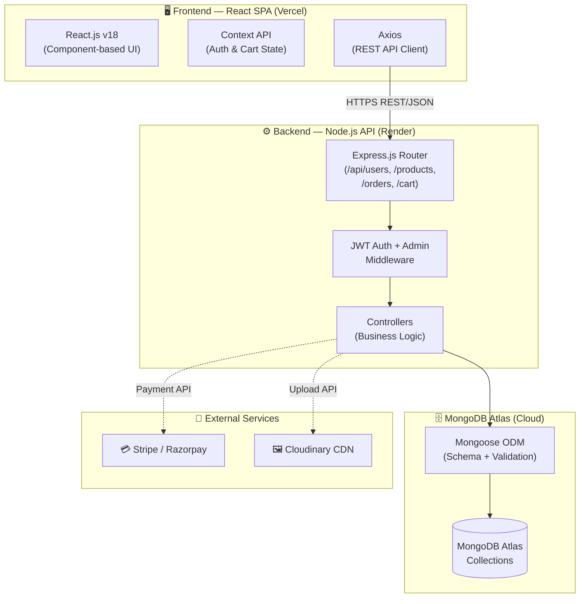
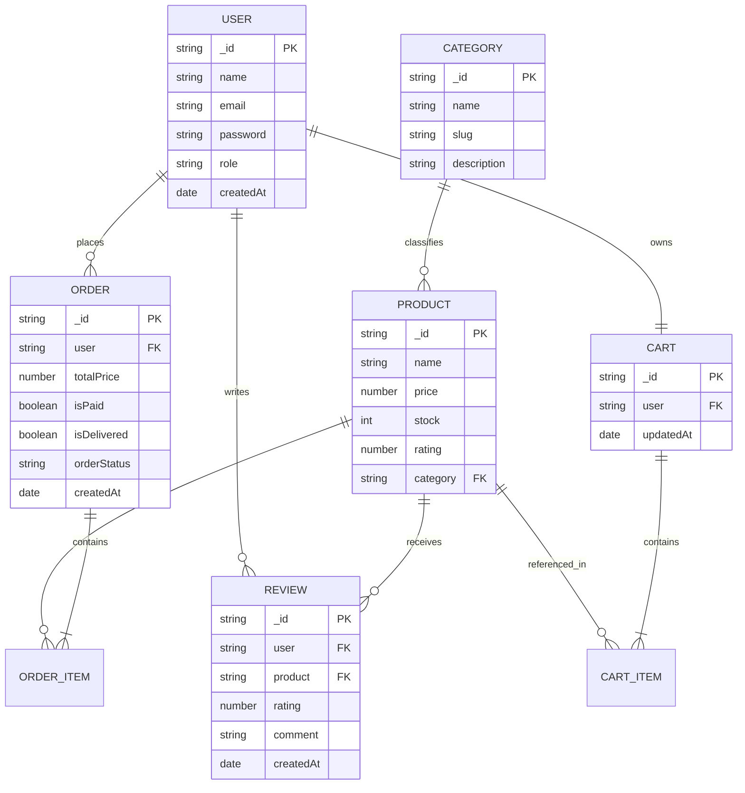
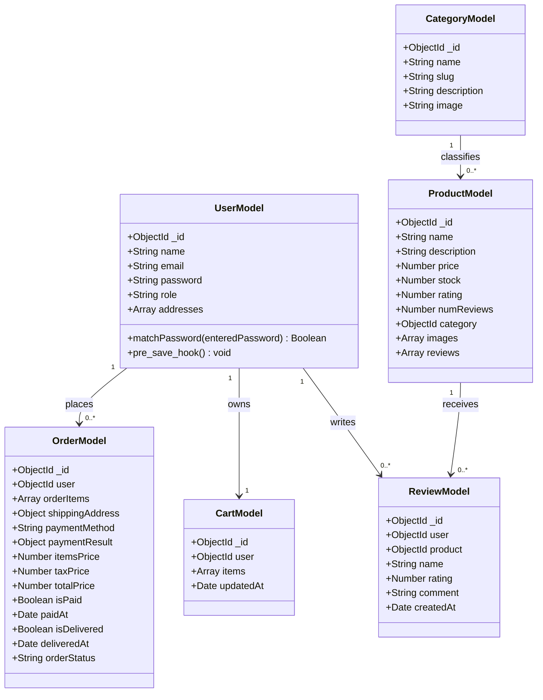

# Full Stack Development with MERN — Project Documentation (FSD)

**Document Version**: 1.1
**Document Classification**: Technical Reference
**Date**: 11 June 2026
**Project Name**: ShopEZ — MERN Stack E-commerce Application
**Prepared by**: V S S S Manikanta
**Repository**: `https://github.com/vadagammanikanta/VIP-C2-ShopEZ-E-commerce-Application`

---

## 1. Introduction

### 1.1 Project Title
**ShopEZ** — A Full-Stack MERN E-commerce Platform

### 1.2 Executive Summary
ShopEZ is a production-grade, full-stack e-commerce application developed using the **MERN** (MongoDB, Express.js, React.js, Node.js) technology stack. The platform provides a comprehensive retail solution encompassing customer-facing product discovery, cart management, and payment processing, alongside a dedicated administrative portal for inventory, order fulfilment, and business analytics management.

The application is deployed in a decoupled cloud configuration — the React SPA is hosted on **Vercel** and the Node.js API on **Render** — with **MongoDB Atlas** as the cloud-hosted database and **Cloudinary** for media storage.

### 1.3 Scope
This document serves as the primary technical reference for the ShopEZ project, covering architecture, database design, API specification, setup instructions, authentication mechanisms, testing strategy, and known issues.

---

## 2. System Architecture

### 2.1 Architecture Overview



### 2.2 Architectural Layers

| Layer | Technology | Responsibility |
| :---- | :--------- | :------------- |
| **Presentation** | React.js + Context API | UI rendering, state management, routing, API communication |
| **Application / API** | Express.js + Middleware | Request routing, authentication, validation, business logic orchestration |
| **Business Logic** | Express Controllers | Domain-specific operations: user management, product CRUD, order processing |
| **Data Access** | Mongoose ODM | Schema definition, validation, query execution, lifecycle hooks |
| **Persistence** | MongoDB Atlas | Document storage, indexing, aggregation |

---

## 3. Database Design

### 3.1 Entity Relationship Overview



### 3.2 Mongoose Model Class Diagram (UML)




---

## 4. Authentication Flow

### 4.1 Authentication Sequence Diagram

```mermaid
sequenceDiagram
    actor User
    participant Client as React App
    participant API as Express API
    participant DB as MongoDB
    participant Cookie as HTTP-only Cookie

    User->>Client: Enter email & password → Submit
    Client->>API: POST /api/users/login {email, password}
    API->>DB: Find User by email
    DB-->>API: User document (with hashed password)
    API->>API: Bcrypt.compare(entered, stored hash)
    alt Credentials Valid
        API->>Cookie: Set-Cookie: jwt=<signed_token>; HttpOnly; SameSite=Strict
        API-->>Client: 200 OK {user: {_id, name, email, role}}
        Client->>User: Redirect to Dashboard / Homepage
    else Credentials Invalid
        API-->>Client: 401 Unauthorised {message: "Invalid email or password"}
        Client->>User: Display error notification
    end
```

### 4.2 JWT Middleware

Protected API routes are guarded by two middleware functions:

```javascript
// protect — Validates JWT from HTTP-only cookie
const protect = async (req, res, next) => {
    const token = req.cookies.jwt;
    if (!token) return res.status(401).json({ message: 'Not authorised — no token' });
    const decoded = jwt.verify(token, process.env.JWT_SECRET);
    req.user = await User.findById(decoded.userId).select('-password');
    next();
};

// isAdmin — Enforces administrator role restriction
const isAdmin = (req, res, next) => {
    if (req.user && req.user.role === 'admin') {
        next();
    } else {
        res.status(403).json({ message: 'Not authorised as an administrator' });
    }
};
```

---

## 5. Setup & Installation

### 5.1 Prerequisites

| Requirement | Version |
| :---------- | :------ |
| Node.js | v18 LTS or above |
| MongoDB | Atlas cluster (or local v6.x) |
| npm | v9.x or above |
| Stripe Account | For test payment keys |
| Cloudinary Account | For image upload credentials |

### 5.2 Environment Variables

Create a `.env` file in the `/server` directory with the following keys:

```env
PORT=8000
MONGO_URI=mongodb+srv://<user>:<password>@<cluster>.mongodb.net/shopez
JWT_SECRET=your_secret_key_here
STRIPE_SECRET_KEY=sk_test_your_stripe_key
CLOUDINARY_CLOUD_NAME=your_cloud_name
CLOUDINARY_API_KEY=your_api_key
CLOUDINARY_API_SECRET=your_api_secret
```

### 5.3 Installation Steps

```bash
# 1. Clone the repository
git clone https://github.com/vadagammanikanta/VIP-C2-ShopEZ-E-commerce-Application.git

# 2. Install Server Dependencies
cd server && npm install

# 3. Seed the database with sample products and admin account
npm run seed

# 4. Start the backend API server
npm run dev   # Runs on http://localhost:8000

# 5. In a new terminal — Install Client Dependencies
cd ../client && npm install

# 6. Start the React development server
npm run dev   # Runs on http://localhost:5173
```

---

## 6. Complete API Reference

### 6.1 User Endpoints

| Method | Endpoint | Auth | Description |
| :----- | :------- | :--- | :---------- |
| POST | `/api/users/register` | No | Register a new user |
| POST | `/api/users/login` | No | Authenticate and issue JWT |
| POST | `/api/users/logout` | Yes | Clear JWT cookie |
| GET | `/api/users/profile` | Yes | Get user profile |
| PUT | `/api/users/profile` | Yes | Update user profile |
| GET | `/api/users` | Admin | Get all users |
| DELETE | `/api/users/:id` | Admin | Delete a user |

### 6.2 Product Endpoints

| Method | Endpoint | Auth | Description |
| :----- | :------- | :--- | :---------- |
| GET | `/api/products` | No | Get products (supports `?keyword`, `?category`, `?minPrice`, `?maxPrice`, `?rating`) |
| GET | `/api/products/:id` | No | Get single product |
| POST | `/api/products` | Admin | Create product |
| PUT | `/api/products/:id` | Admin | Update product |
| DELETE | `/api/products/:id` | Admin | Delete product |
| POST | `/api/products/:id/reviews` | User | Submit a review |

### 6.3 Order Endpoints

| Method | Endpoint | Auth | Description |
| :----- | :------- | :--- | :---------- |
| POST | `/api/orders` | User | Create new order |
| GET | `/api/orders/myorders` | User | Get user's order history |
| GET | `/api/orders/:id` | User/Admin | Get order by ID |
| PUT | `/api/orders/:id/pay` | User | Mark order as paid |
| PUT | `/api/orders/:id/deliver` | Admin | Mark order as delivered |
| GET | `/api/orders` | Admin | Get all orders |

---

## 7. Project Folder Structure

```
shopez/
├── client/                     # React.js SPA
│   └── src/
│       ├── components/         # Reusable UI components (Navbar, Footer, etc.)
│       ├── context/            # AuthContext.jsx, CartContext.jsx
│       ├── pages/              # Route-level page components
│       └── main.jsx            # Application entry point
│
├── server/                     # Node.js / Express API
│   ├── config/                 # db.js (MongoDB connection)
│   ├── controllers/            # Business logic handlers
│   ├── middleware/             # authMiddleware.js, errorMiddleware.js
│   ├── models/                 # Mongoose schema definitions
│   ├── routes/                 # Express route definitions
│   ├── Schema.js               # Consolidated schema reference
│   └── server.js               # Express application entry point
│
└── docs/                       # Project documentation
    ├── phase_wise/             # Phase-by-phase documentation artefacts
    └── technical_architecture.md
```

---

## 8. Testing Strategy

| Level | Methodology | Tools | Scope |
| :---- | :---------- | :---- | :---- |
| **Unit Testing** | Isolated component and function testing | Jest, React Testing Library | Cart reducer, auth utilities |
| **Integration Testing** | API endpoint request/response verification | Postman, Newman | All REST endpoints in `/api/*` |
| **User Acceptance Testing** | Manual end-to-end scenario testing | Chrome / Edge Browser | 16 defined UAT test cases (see UAT document) |

---

## 9. Known Issues & Limitations

| Issue ID | Description | Severity | Mitigation |
| :------- | :---------- | :------- | :--------- |
| KI-01 | Cart state may desync if a user is simultaneously logged in on two devices and both modify the cart concurrently. | Medium | Server-side `updatedAt` timestamp comparison on cart save operations |
| KI-02 | The Render free-tier backend enters a cold-start sleep after 15 minutes of inactivity, causing a 30–60 second initial response delay. | Low | Upgrade to paid tier for production; or implement a keep-alive ping service |
| KI-03 | No email verification on user registration — an invalid email address can be used to register. | Low | Add Nodemailer-based verification email flow in a future release |

---

## 10. Future Enhancements

| Priority | Enhancement | Description |
| :------- | :---------- | :---------- |
| 🟡 Medium | **Email Notifications** | Trigger confirmation and shipping update emails via Nodemailer / SendGrid |
| 🟢 Low | **Wishlist** | Allow users to save products for future purchase consideration |
| 🔵 Future | **AI Recommendations** | Implement collaborative filtering for personalised product suggestions |
| 🔵 Future | **Multi-Vendor Marketplace** | Extend the platform to support multiple independent sellers with revenue-share commissions |
| 🔵 Future | **Mobile Application** | Develop a React Native companion app consuming the existing REST API |

---

## 11. Live Deployment

| Resource | URL |
| :------- | :-- |
| **Live Application** | `https://e-commerce-application-neon-five.vercel.app/` |
| **API Base URL** | `https://shopez-api-c30e.onrender.com` |
| **Admin Account** | `admin@shopez.com` / `adminpassword123` |
| **Customer Account** | `test@email.com` / `password123` |

---
*Document controlled by V S S S Manikanta — June 2026*
*Full Stack Development with MERN — VIP C2 Programme*
