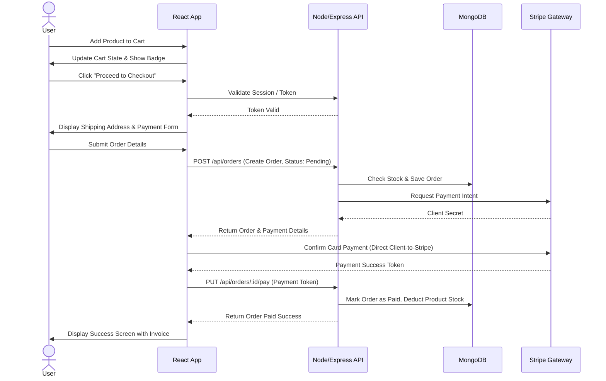

# User Flows

This document maps out key user journeys on the E-commerce platform.

## Customer Checkout Flow

This diagram outlines how a user adds items to the cart, interacts with backend APIs, and completes a payment transaction via Stripe.

---
[◄ Back to Project Architecture](../project_architecture.md) | [Back to Home](../README.md)
