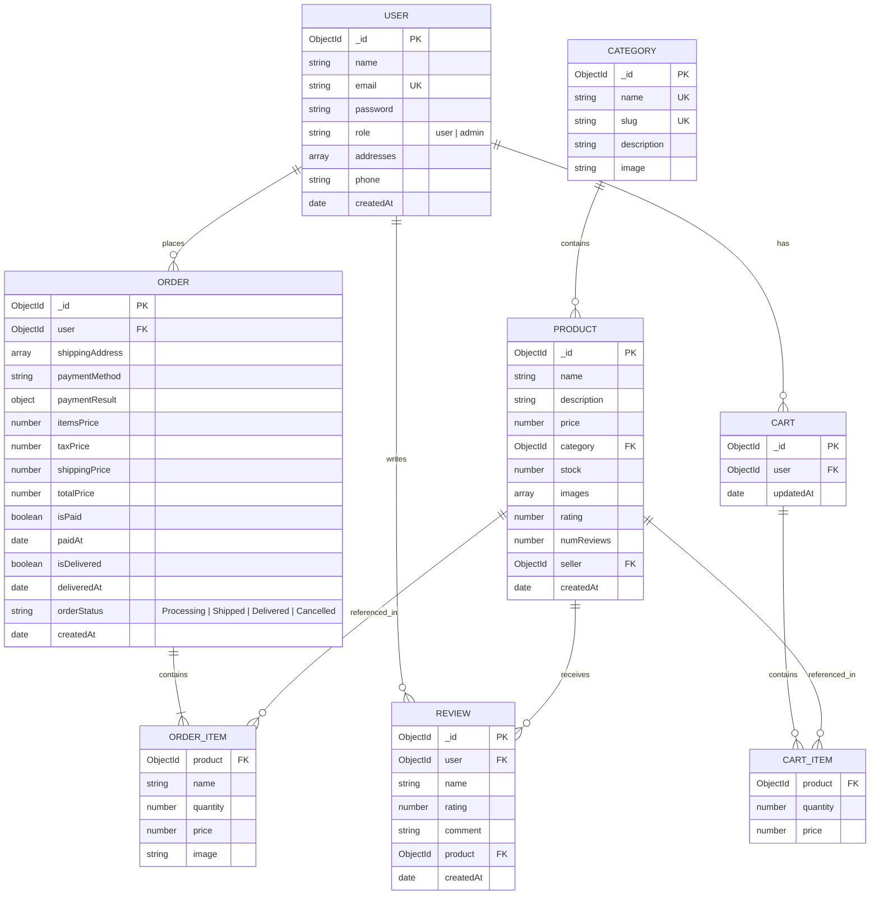
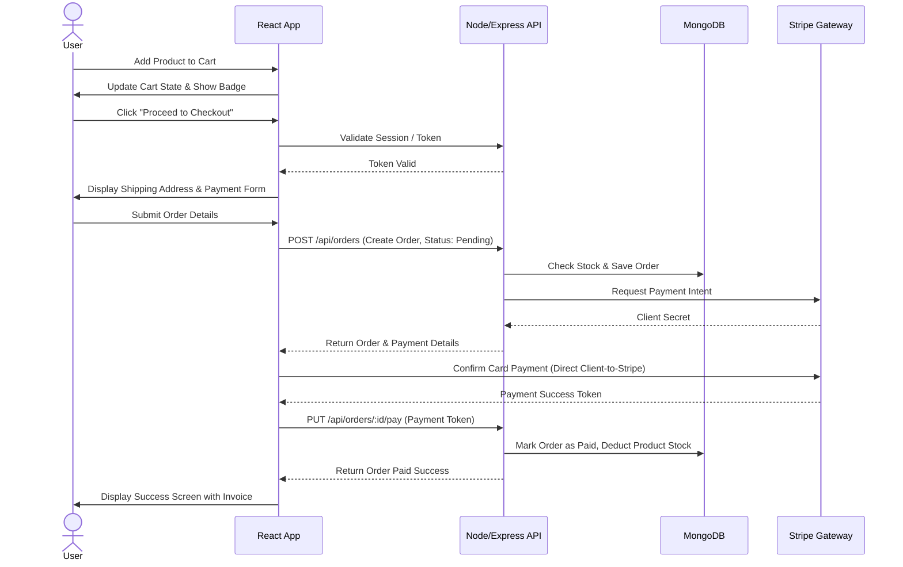

# MERN Stack E-commerce Project Architecture

This document presents the detailed architectural design and structure for the **MERN Stack E-commerce Application**.

---

## 1. Technical Architecture

The application is structured as a decoupled client-server model using the **MERN** (MongoDB, Express, React, Node.js) stack, supplemented by industry-standard third-party integrations.

```mermaid
graph TD
    %% Frontend Layer
    subgraph Client ["Client (Frontend)"]
        React["React.js (SPA)"]
        Redux["Redux Toolkit (State Management)"]
        UI["CSS / Styled Components"]
        Axios["Axios / Fetch API"]
        React --> Redux
        React --> UI
        React --> Axios
    end

    %% Network Layer
    Axios -->|HTTP REST API (JSON / HTTPS)| ExpressRouter

    %% Backend Layer
    subgraph Server ["Server (Backend - Node.js)"]
        ExpressRouter["Express.js Router"]
        AuthMiddleware["JWT Auth & Role Middlewares"]
        Controllers["Controllers (Business Logic)"]
        MongooseODM["Mongoose (ODM)"]

        ExpressRouter --> AuthMiddleware
        AuthMiddleware --> Controllers
        Controllers --> MongooseODM
    end

    %% Database Layer
    subgraph Database ["Database Layer"]
        MongoDB[("MongoDB Database")]
        MongooseODM --> MongoDB
    end

    %% External Services
    subgraph External ["External Services"]
        Stripe["Stripe / Razorpay (Payments)"]
        Cloudinary["Cloudinary (Image Storage)"]
        SendGrid["Nodemailer / SendGrid (Emails)"]
    end

    Controllers -.-> Stripe
    Controllers -.-> Cloudinary
    Controllers -.-> SendGrid
```

### Components Description:
*   **React Client**: Handles the single-page application (SPA) client interface, managing dynamic UI rendering, client-side routing (React Router), and global state (Redux/Context API).
*   **Express Server**: Handles routing, validation, application controllers, middleware processing (e.g., authentication, error handling), and APIs.
*   **MongoDB**: Serves as the database storing documents for users, products, categories, orders, and reviews.
*   **External Integrations**: Cloudinary manages product image uploads. Payment processors handle transaction flows securely.

---

## 2. ER Diagram (Entity-Relationship)

The entity relationships represent how data structures are designed in MongoDB using Mongoose schemas.



---

## 3. Features

### Customer-Facing Features
1.  **Authentication & Authorization**:
    *   Secure User Signup & Login with email/password.
    *   JSON Web Token (JWT) based authentication stored securely.
    *   Password hashing using `bcrypt`.
2.  **Product Discovery**:
    *   Browse products by Categories.
    *   Text-based Search & Filters (price range, ratings, availability).
    *   Pagination and sorting (price high-to-low, new arrivals, etc.).
3.  **Shopping Cart**:
    *   Persistent cart (stored in database for logged-in users or local storage for guests).
    *   Real-time stock level validation.
4.  **Checkout & Payments**:
    *   Multiple shipping address support.
    *   Secure card processing integration (e.g., Stripe/Razorpay).
    *   Instant order creation and email notifications.
5.  **Reviews & Ratings**:
    *   Verified buyers can rate (1-5 stars) and write comments on purchased products.

### Admin Features
1.  **Dashboard Overview**:
    *   Visual representation of key metrics (daily sales, total orders, new users).
2.  **Product & Inventory Management (CRUD)**:
    *   Add new products with multi-image upload.
    *   Update stock status and details.
    *   Category management.
3.  **Order Processing**:
    *   View all orders, filter by state, and update shipping/delivery statuses.
4.  **User Management**:
    *   View users, edit roles, or deactivate accounts.

---

## 4. Roles and Responsibilities

The application implements Role-Based Access Control (RBAC) to ensure security and privacy.

| Role | Responsibilities | Permissions & Capabilities |
| :--- | :--- | :--- |
| **Guest / Visitor** | Browse products and research | • View homepage, search, filter, and view product pages.<br>• Add items to temporary shopping cart. |
| **Registered User** | Place orders and manage account | • Manage profiles, shipping addresses, and preferences.<br>• Perform checkout and complete payments.<br>• View order history and status.<br>• Write reviews/ratings. |
| **Administrator** | Manage the store operations | • Access secure admin panel `/admin`.<br>• Create, Read, Update, and Delete (CRUD) products and categories.<br>• Manage order fulfillment and ship items.<br>• View sales analytics dashboards. |

---

## 5. User Flow

The diagrams below outline the primary navigation journeys for users on the platform.

### Customer Checkout Flow


---

## 6. MVC Pattern Mapping in MERN

MERN applications distribute the classic Model-View-Controller pattern across the Client (Frontend) and Server (Backend):

```
       [ BROWSER ] ◄────────────────────────────────────────┐
            │                                               │
            ▼                                               │
┌───────────────────────┐                                   │
│         VIEW          │ (React Components & UI)           │ HTTP
└───────────┬───────────┘                                   │ Response
            │ Trigger Events (API Requests)                 │
            ▼                                               │
┌────────────────────────────────────────────────────────┐  │
│                      SERVER (Node/Express)             │  │
│                                                        │  │
│   ┌───────────────┐        ┌───────────────┐           │  │
│   │    ROUTER     │ ─────► │  CONTROLLER   │           │──┘
│   └───────────────┘        └───────┬───────┘           │
│                                    │ interacts         │
│                                    ▼                   │
│                            ┌───────────────┐           │
│                            │     MODEL     │ (Mongoose)│
│                            └───────┬───────┘           │
└────────────────────────────────────┼───────────────────┘
                                     ▼
                               ┌───────────┐
                               │ DATABASE  │ (MongoDB)
                               └───────────┘
```

1.  **View (Client Layer - React)**:
    *   Responsible for rendering pages and capturing user interactions.
    *   State stores are located in `src/redux` or local states.
    *   React views communicate via REST endpoints.
2.  **Router (Entry Layer - Express Routes)**:
    *   Receives incoming HTTP requests (e.g., `GET /api/products`, `POST /api/orders`).
    *   Applies middleware (e.g., authentication check, inputs validation).
    *   Forwards parameters to the appropriate Controller function.
3.  **Controller (Logic Layer - Express Controllers)**:
    *   Coordinates actions between Models and Views.
    *   Processes business rules, calls databases, handles responses (JSON success or error).
4.  **Model (Data Layer - Mongoose Schema)**:
    *   Defines schemas, constraints (e.g., indices, required fields), and database logic.
    *   Interacts directly with MongoDB using Mongoose methods.
