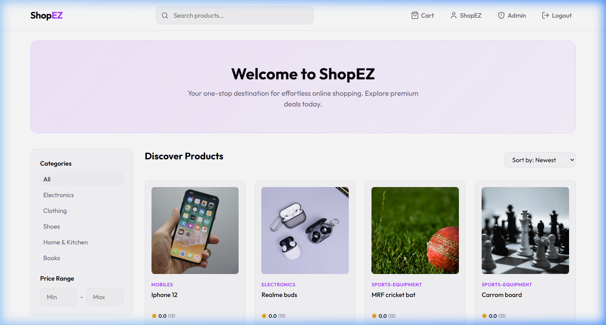
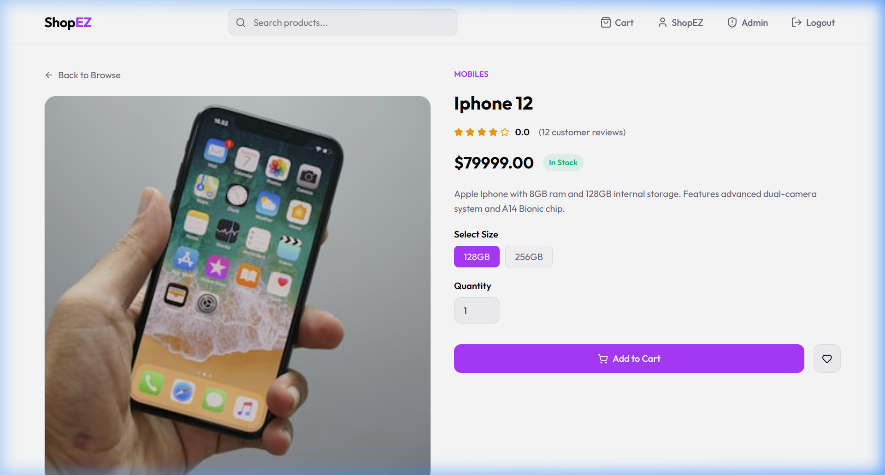
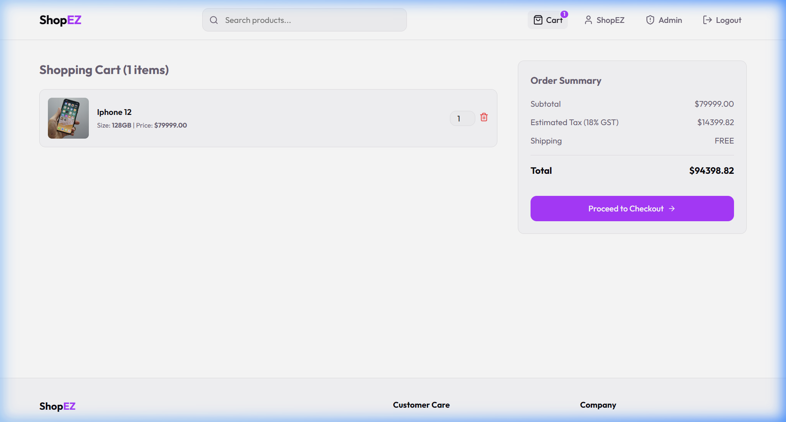
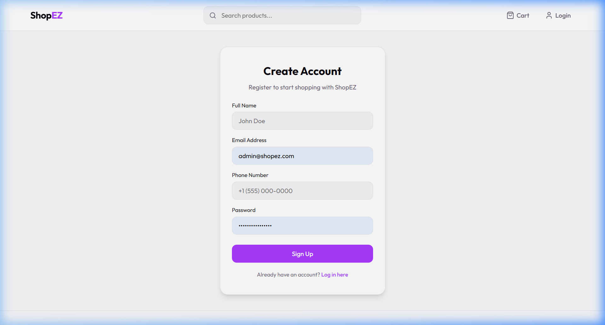
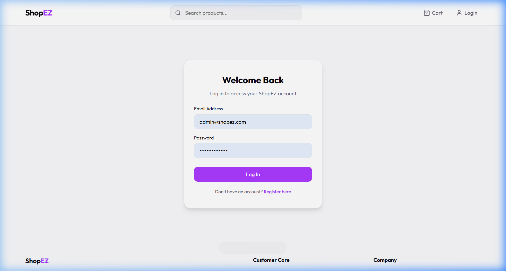
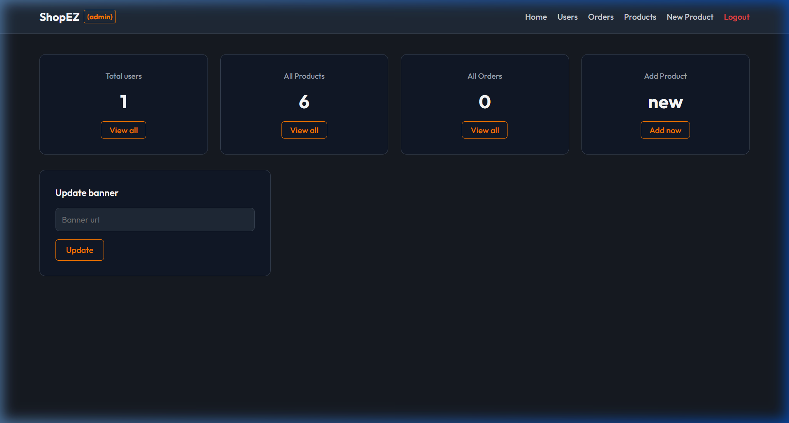

# ShopEZ E-Commerce UI Walkthrough

Welcome to the ShopEZ E-Commerce UI Walkthrough! This document lists and demonstrates the user interfaces built for the MERN Stack application. 

All screenshots are stored directly inside the repository under the `screenshots/` directory.

---

## 📸 UI Screenshots & Flow

### 1. Discover Products (Homepage)
The landing page displays product listings retrieved dynamically from MongoDB Atlas. It features a hero banner, categories sidebar, price range filtering, and a sorting selector.


---

### 2. Product Detail View
Clicking on any product card displays its high-resolution images, detailed descriptions, sizing options, stock indicators, and customer review counts.


---

### 3. Shopping Cart
The shopping cart manages added items, calculates sub-totals, adds estimated GST (18%), and lets users adjust item quantities.


---

### 4. Create Account (Register Page)
A clean form to register new accounts. All credentials are encrypted and stored in MongoDB.


---

### 5. Welcome Back (Login Page)
A clean, secure form for user authentication using JSON Web Tokens (JWT).


---

### 6. Admin Dashboard
A premium dark-themed dashboard accessible only to administrators (`admin@shopez.com`). It displays database statistics (total users, products, and orders) and permits CRUD operations on products and orders management.


---

## 🚀 Local Execution & Verification
To run this project locally, refer to the guidelines in [README.md](./README.md) or follow these simple commands:

1. **Start Backend Server**:
   ```bash
   cd server
   npm run dev
   ```
2. **Start Frontend Client**:
   ```bash
   cd client
   npm run dev
   ```
3. **Database Seeding**:
   ```bash
   cd server
   npm run seed
   ```
